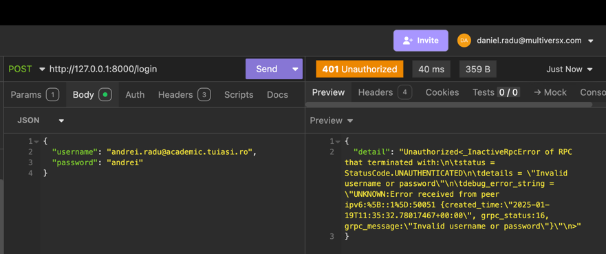
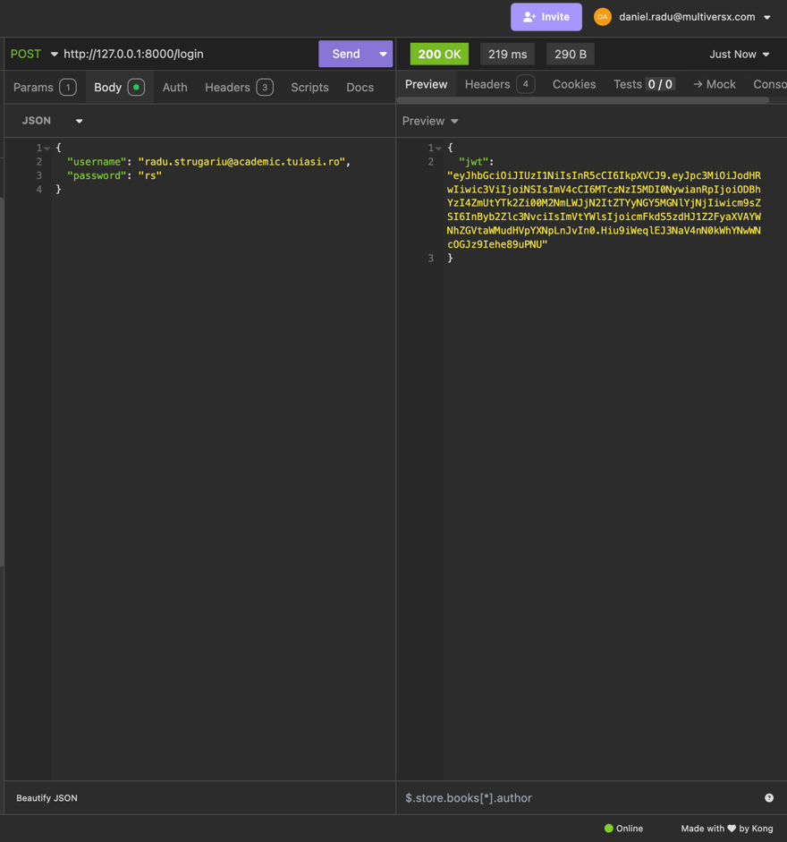
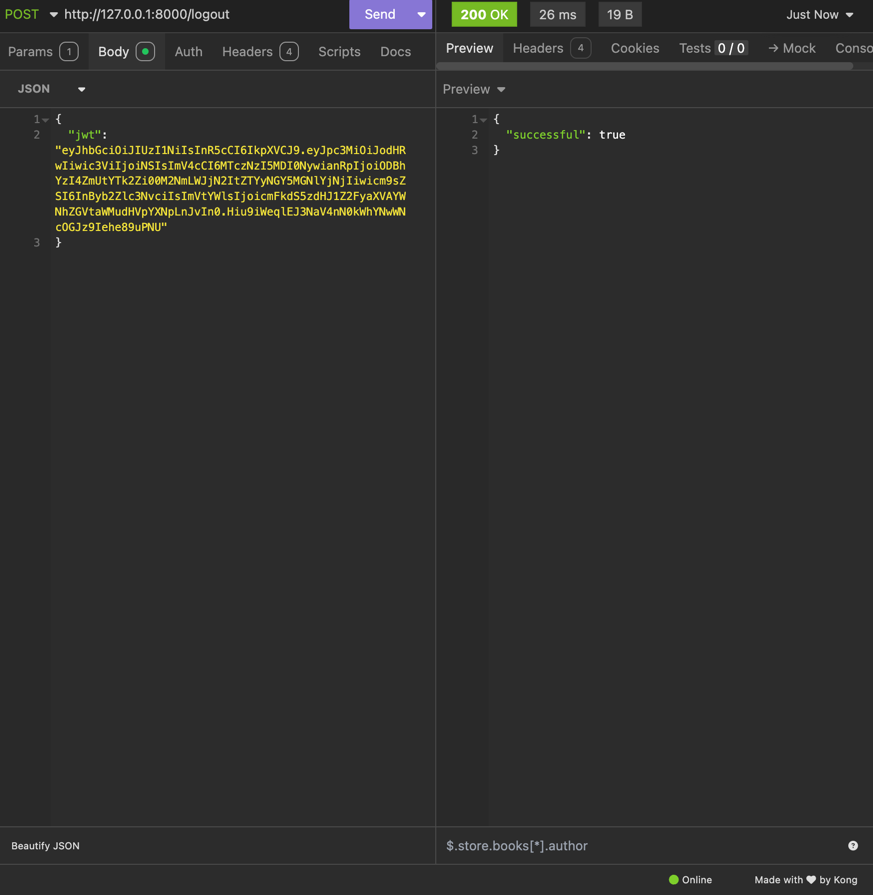
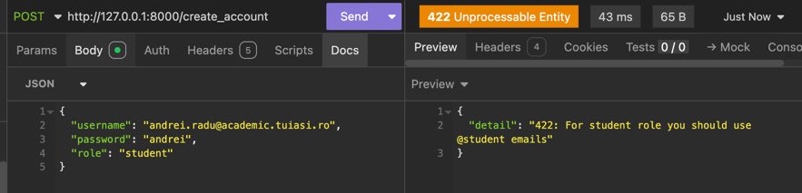
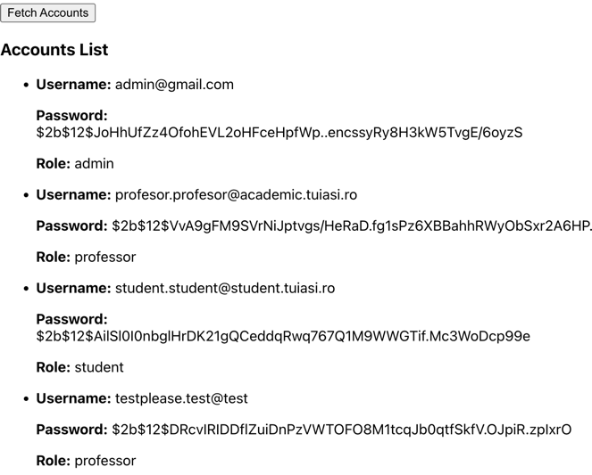

## Acest document prezinta cele mai importante aspecte din AuthService.

#  
| Nr |                                                                                            Aspecte importante                                                                                            | 
|:--:|:--------------------------------------------------------------------------------------------------------------------------------------------------------------------------------------------------------:|
| 1  |                                                                                      Serverul este scris in Python.                                                                                      |    
| 2  |                                                                       Parolele sunt criptate inainte de a fi introduse in tabela.                                                                        |    
| 3  |                                                                                      Pentru useri folosim MariaDB.                                                                                       |
| 4  |                                                                               Tokenii blacklistati sunt adaugati in Redis.                                                                               |    
| 5  |    Este creat si un API, folosind FastAPI, deasupra a doua metode ale serverului - login si logout pentru a-l integra cu frontendul. (doar cu frontendul!) (implementarea cu envoy.yml nu a reusit.)     |  
| 6  | API-ul contine si o metoda de creare de utilizatori, accesibila doar adminului. Metoda face verificarile necesare unui cont valid - (e.g. username-ul sa contina "academic" in cazul unui profesor etc.) | 
| 7  |                                                       Tot in API gasim si o functie care returneaza toate conturile (accesibila doar pentru admin)                                                       | 
| 8  |                                                                      Cele doua metode apartin unui serviciu numit AccountsManager.                                                                       | 

# LOGS

### Login cu username gresit sau parola gresita

### Login cu username corect si parola corecta

### Logout

### Create account with unprocessable entity

### Fetch accounts

