## Acest document prezinta cele mai importante aspecte din Material.

#  
| Nr |                                               Aspecte importante                                                | 
|:--:|:---------------------------------------------------------------------------------------------------------------:|
| 1  |                             Componenta este dezvoltata folosind Python si FastAPI.                              |    
| 2  |                                  Se foloseste o baza de date NoSQL - MongoDB.                                   |    
| 3  | Pentru autentificare folosim un Middleware care apeleaza serviciul de Validare (unde se creeaza clientul gRPC). |    
| 4  | Responsabilitatile sunt bine izolate, avand cate un serviciu cu scop unic - Validator, Disciplines, Materials.  |  
| 6  |                           In baza de date se salveaza chiar continutul materialelor.                            | 
| 7  |                   Pentru fiecare disciplina salvam si id-ul titularului pentru extra checks.                    | 

#  Controlul accesului pentru rute.
**NOTE: sunt prezentate doar cele mai importante aspecte aici.**

#### 1. Cine poate insera o disciplina?
Inserarea disciplinei poate fi facuta doar de admin. 
Astfel, in frontend se vor compune doua apeluri - inserarea unei discipline in ProfiStudenti si inserarea in Materiale.
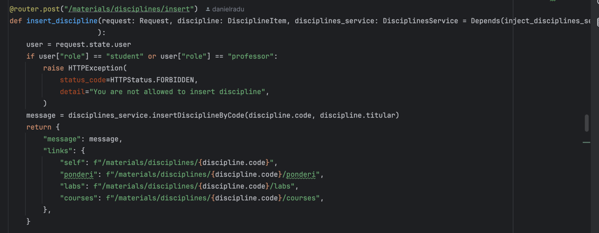

#### 2. Cine poate insera ponderile unei discipline?
Inserarea ponderilor poate fi facuta de admin sau de profesor. 
Totusi, la profesor se face un extra-check, iar aici ne ajuta faptul ca am salvat in mongo titular, deoarece verificam ca emailul titularului este acelasi cu emailul callerului.
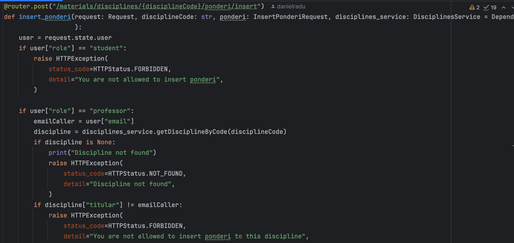

#### 3. Cine poate insera materiale de curs/laborator?
La fel ca mai sus, in cazul profesorului verificam daca este titular al disciplinei.
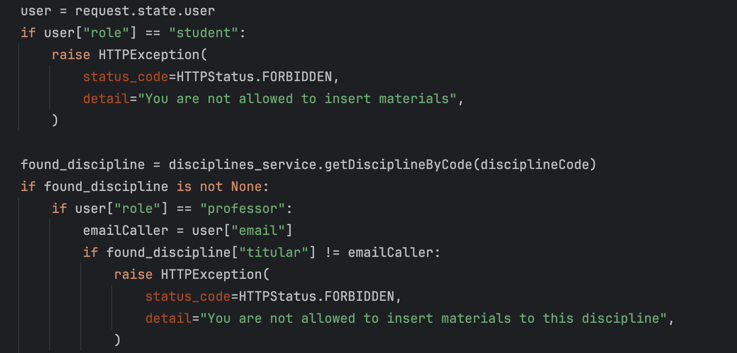

# HATEOAS

### 1. Ce linkuri se returneaza in cazul returnarii disciplinelor?

In cazul in care se cer disciplinele, returnam pentru fiecare disciplina toate linkurile care ofera informatii despre disciplina respectiva dar si operatii pentru acea disciplina.
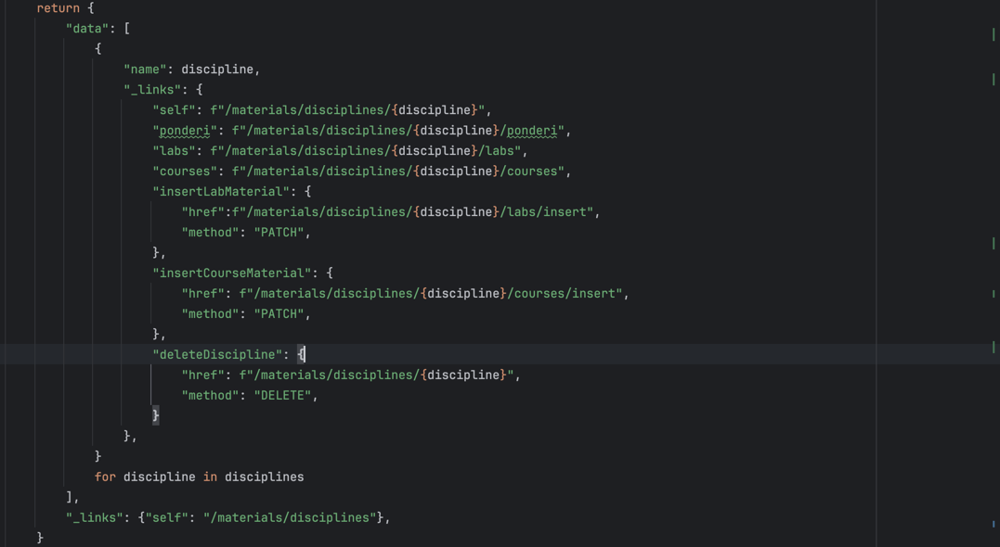

### 2. Ce linkuri se returneaza in cazul returnarii materialelor unei discipline (lab/course)?
In cazul in care se cer materialele, pentru fiecare material returnam linkul spre el (lucru deosebit de imporant in vizualizarea profilului unui profesor), iar pentru toata lista se ofera link spre pagini pentru iterarea prin materiale.
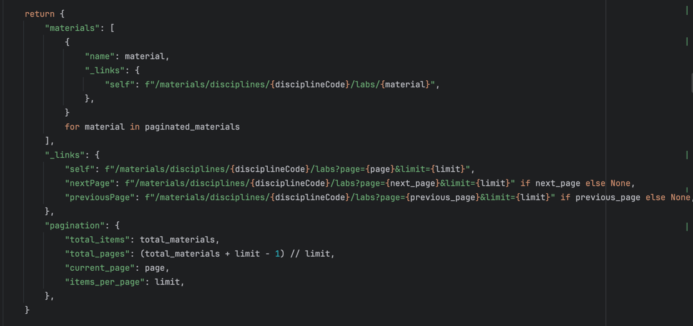

### 3. Ce linkuri se returneaza in cazul inserarii unei discipline?
In cazul in care inseram o disciplina returnam toate linkurile catre informatiile acelei disciplina si catre posibilitatea de a adauga materiale catre discipline.
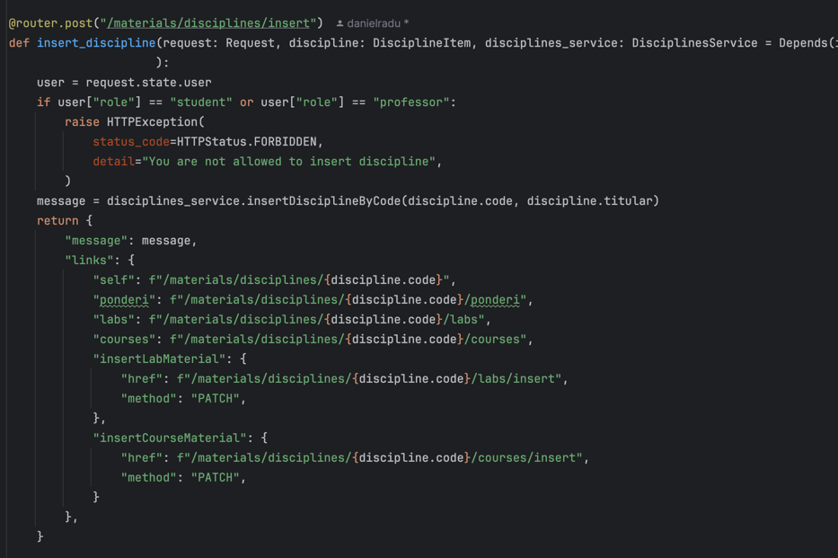

### 4. Ce linkuri se returneaza in cazul inserarii unui material?
In cazul inserarii unui material returnam link catre toate materialele, iar pentru fiecare material returnam cate un link.
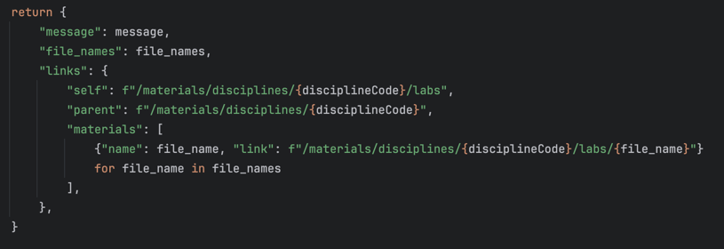

### 5. Ce linkuri se returneaza in cazul stergerii unui material?
In cazul stergerii unui material returnam link catre materialele ramase.
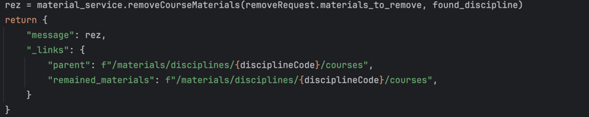

# Coduri de raspuns utilizate

**Note: aici sunt doar cateva exemple**

### 1. CONFLICT
Acesta este un exemplu in care returnam conflict, atunci cand inseram o disciplina care deja exista.
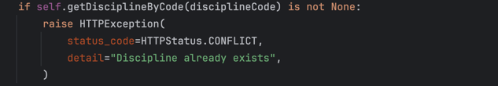

### 2. UNPROCESSABLE ENTITY
Acesta este un exemplu, la inserarea ponderilor, in care verificam ca suma acestora este 100.
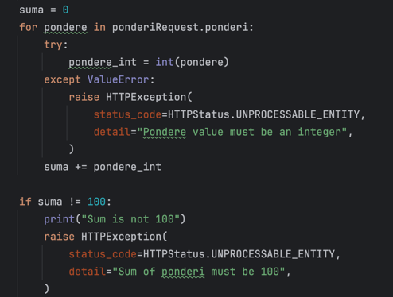

### 3. NOT FOUND
Returnam not found atunci cand incercam sa facem o operatie pe o disciplina care nu exista.
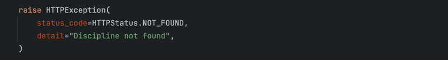

# LOGS
#### Returnarea unei discipline care nu exista.
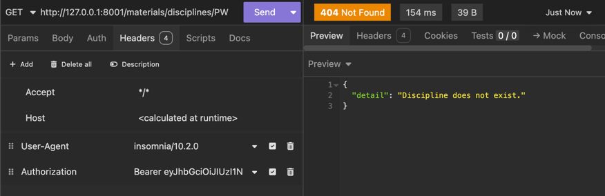

### Returnarea listei de discipline
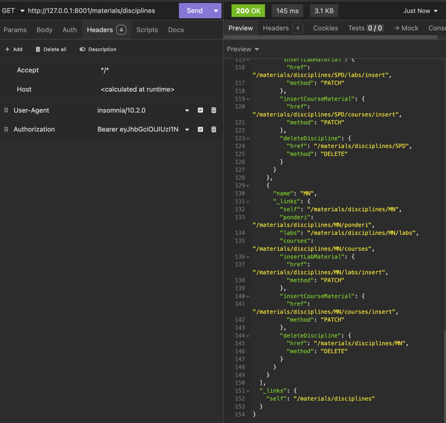

### Returnarea ponderilor
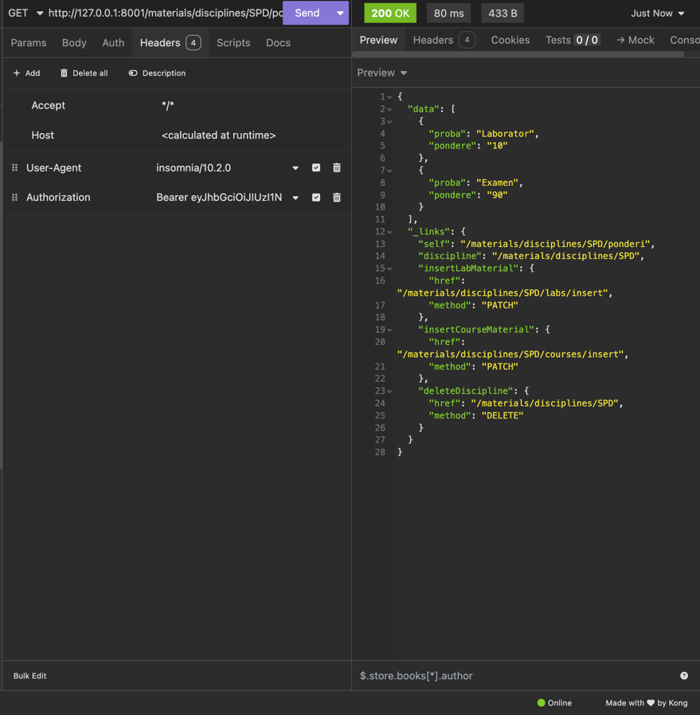

### Inserarea ponderilor care nu au suma de 100.
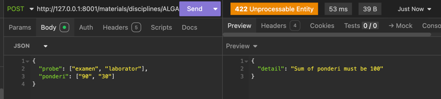

### Numele disciplinelor.
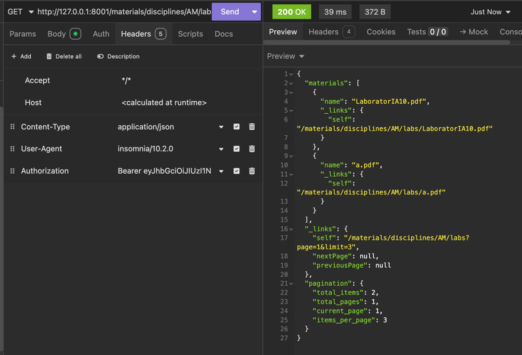

### Vizualizarea unui material specific.
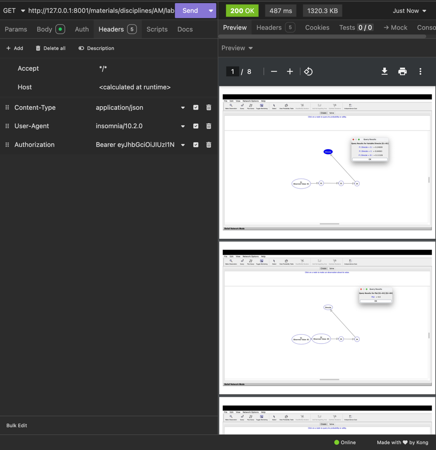