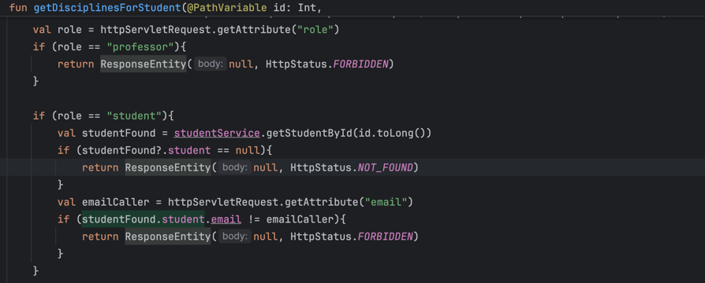
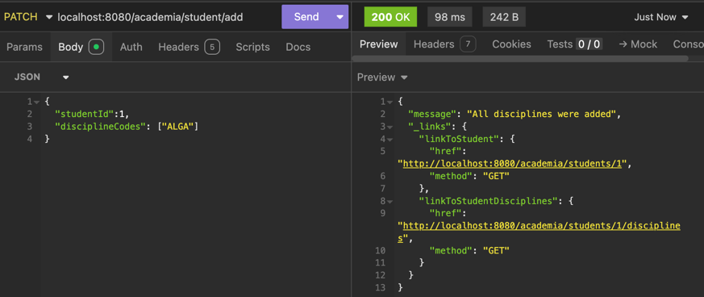

## Acest document prezinta cele mai importante aspecte din ProfiStudenti.

#  
| Nr |                                                                  Aspecte importante                                                                  | 
|:--:|:----------------------------------------------------------------------------------------------------------------------------------------------------:|
| 1  |                                                 Componenta este dezvoltata folosind Kotin si Spring.                                                 |    
| 2  |                                                      Se foloseste o baza de date SQL - MariaDB.                                                      |    
| 3  |                 Pentru autentificare folosim un Filter care creeaza un client gRPC. Tot in Filter este rezolvata si partea de CORS.                  |    
| 4  |                    Responsabilitatile sunt bine izolate, avand cate un serviciu cu scop unic - Students, Disciplines, Professors.                    |    
| 5  |                           Raspunsurile cererilor sunt impachetate in structuri de raspuns (e.g. GetStudentsResponse etc.)                            |  
| 6  | Fiecare serviciu a fost testat pe parcursul dezvoltarii prin teste unitare si teste de integrare. Exemple de teste pot fi gasite in ultima sectiune. | 
| 7  |                          Diferite modalitati de cautare - (partiale dupa nume pentru student, grupa, toti parametrii etc.).                          | 

#  Controlul accesului pentru rute.
**NOTE: sunt prezentate doar cele mai importante aspecte aici.**
### Voi prezenta in aceasta sectiune cele mai importante verificari care sunt realizate pe diferite rute. 

#### 1. Cine poate vizualiza un profesor dupa id/email?

Observam ca returnam Forbidden nu doar in cazul unui student, ci si in cazul unui profesor care are un email diferit fata de cel al profesorului pe care il cauta.

### 2. Cine poate vizualiza un student dupa id/email?

Observam ca returnam Forbidden nu doar in cazul unui profesor, ci si in cazul unui student care are un email diferit fata de cel al studentului pe care il cauta.

**NOTE: in ambele situatii, email-ul caller-ului este luat din tokenul de autentificare.**

### 3. Cine poate vizualiza o disciplina?

Observam ca, in cazul vizualizarii unei discipline, daca caller-ul este un student, verificam ca disciplina se afla in lista lui de discipline.

### 4. Cine poate vizualiza disciplinele/studentii unui profesor?

In cazul in care un profesor vrea sa vada disciplinele altui profesor, returnam Forbidden.

Acelasi lucru se intampla si in cazul vizualizarii studentilor.

### 5. Cine poate vizualiza disciplinele unui student?

Disciplinele unui student pot fi vazut fie de admin, fie de studentul inscris la acele discipline. 
Un student nu poate vedea disciplinele altui student.

### 6. Cine poate adauga/sterge discipline/studenti/profesori?
Doar adminul.

# HATEOAS.
**NOTE: sunt prezentate doar cele mai importante aspecte aici.**

### 1. Ce linkuri se returneaza in cazul unui profesor respectiv o lista de profesori?
In cazul unui profesor returnam studentii profesorului, disciplinele acestuia si ruta de DELETE.
Primele 2 sunt foarte importante si folosite pentru incarcarea "profilului" unui profesor in frontend.

Apoi, pentru toata lista de profesori returnam si linkuri pentru iterarea printre acestia.

### 2. Ce linkuri returnam in cazul unei discipline / liste de discipline?
In cazul unei discipline, pe langa self si parent, returnam link spre profesorul titular, spre stergerea disciplinei sau stergerea acesteia din listele studentilor.
Aceste linkuri sunt extrem de folositoare si folosite in react pentru operatiile unui admin.

In cazul unei liste de discipline, pe langa linkurile pentru fecare disciplina mentionate mai sus, returnam si linkuri pentru iterarea printre discipline.

### 2. Ce linkuri returnam in cazul unui student / o lista de studenti?
In cazul studentilor returnam linkuri pentru parcurgerea acestora, iar pentru fiecare in parte link catre disciplinele acestuia.

# Coduri de raspuns utilizate.
**NOTE: aici sunt doar cateva exemple!**
**NOTE: alte exemple se pot gasit si in ultima sectiune - Testare**
### 1. Conflict
Acest cod este returnat, spre exemplu, la incercarea inserarii unui student cu un email care deja exista in baza de date:

Mesajul se propaga pana in controller, iar in final acesta returneaza codul corespunzator:

Un alt exemplu in care se foloseste CONFLICT, este cand se incearca stergerea unui profesor care este titular la discipline:

### 2. Unprocessable entity

* verificarile in cazul unui profesor.

Fiecare serviciu verifica datele care ajung la el. Spre exemplu, se verifica mailul, numele sau chiar si numarul de caractere introduse.

* o parte din validarile unui student

### 3. Unauthorized 

Acest cod se returneaza inca din Filter, atunci cand nu exista token de autentificare. 

# Logs

### Cautare profesor.

**NOTE exista si queries - cel mai bine se vor vedea in documentatia frontendului.**

#### In cazul studentilor, cautarile sunt facut dupa parametrii din imagine.

#### Totodata, exista si cautare partiala in functie de ultimul nume.

#### Cautarea unui student dupa id/email.

#### Un student cauta alt student.

#### Cautarea disciplinelor unui student.

#### Un student cauta disciplina sa.

#### Un student cauta o disciplina la care nu este inrolat.

#### Exemplu de unprocessable entity: inserarea unui student cu mail de academic.

#### Exemplu de unprocessable entity: inserarea unei discipline cu titular care nu exista.

### Patch discipline to student.

### Stergerea unui profesor care este titular de discipline.

# TESTARE
## Se vor regasi aici cateva exemple relevante din integration tests.

### Cautarea unui profesor

### Cautarea unui profesor doar dupa prenume

### Empty data

### Non-alphabetic characters

### Different queries

### Forbidden for different caller

### Invalid mail when inserting

### Invalid group when inserting

  
  
  
  
  
