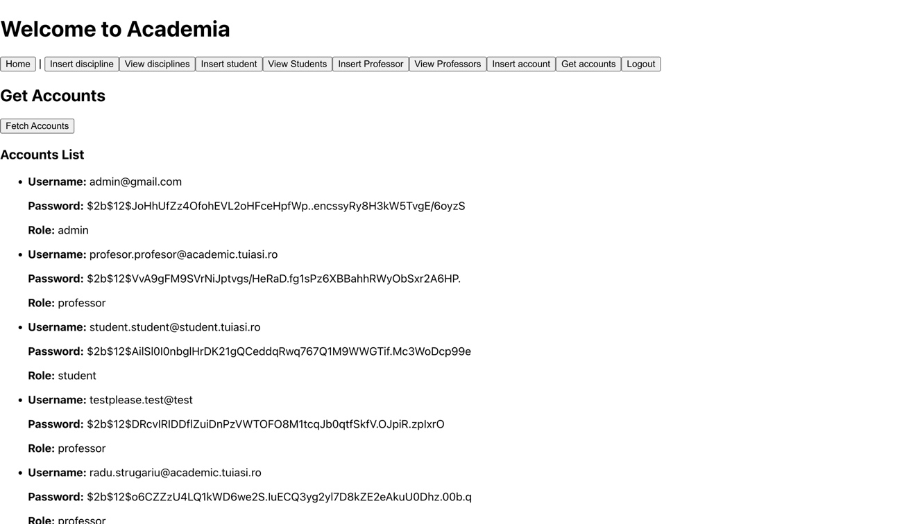
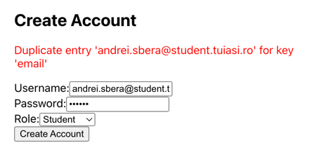

# LOGIN PAGE

La deschiderea aplicatiei, utilizatorul se poate autentifica.
Exista mai apoi 3 variante: profil de student, de profesor sau de admin.

# ADMIN
Admin-ul are acces la majoritatea operatiilor de baza din cadrul aplicatiei.

## Get accounts
Aceasta metoda returneaza toate conturile cu parolele criptate din cadrul aplicatiei.
Metoda a fost implementata pentru a oferi ajutor admin-ului atunci cand doreste sa insereze useri noi.

**NOTE:**
In cazul in care nu exista deloc conturi, in componenta AuthService exista un script - usersGenerator.py care poate fi rulat pentru a incarca 3 accounturi de test.

## Insert account

Prespunem ca un admin incearca sa insereze un cont cu email gresit.

Un cont care  exista deja:

Operatie reusita:

## View professors

### HATEOAS pentru - next page previous page. 

### Daca se apasa pe Delete professor:

### Se apasa apoi pe view disciplines:
## HATEOAS pentru - next page, previous page

### Daca se incearca stergerea unei discipline la care sunt inrolati anumiti studenti.

## Insert professor
### Cazul in care se insereaza cu un mail care exista (exemplu)

### Cazul in care se insereaza cu prea multe caractere (exemplu)

### Cazul in care se insereaza cu succes (exemplu)

## View students
### HATEOAS - next page, previous page

## Daca se apasa pe view details:
### HATEOAS - view disciplines, patch disciplines

## Daca se apasa pe view disciplines:
### HATEOAS - view professor details, view discipline details, delete 

## Daca se apasa pe view professor details se deschid detaliile intr-un tab nou:

## Daca se apasa pe view discipline details se deschid detaliile intr-un tab nou:

## Daca nu se apasa pe view disciplines, dar se apasa pe patch disciplines:

## View disciplines
### HATEOAS pentru toate butoanele care corespund unei discipline si nextPage, previousPage pentru lista de discipline.
### Informatiile din linkuri se deschid in alerte.

## Insert discipline
### Aceasta metoda compune 2 call-uri - unul catre API-ul de materiale iar altul catre API-ul profi studenti.
**NOTE: In Materiale salvam codul disciplinei si titularul.**

### HATEOAS - toate butoanele care apar dupa inserarea disciplinei

# PROFESSOR PROFILE
### HATEOAS - My disciplines, My students, next/previous page in fiecare scenariu

### Insert Ponderi
Aici profesorul poate insera ponderile disciplinei

### Ponderi incorecte

### Ponderi corect
### HATEOAS - view ponderi

### View Ponderi

### Upload Laboratory materials

### Dupa ce se selecteaza disciplina si se apasa Fetch Materials:
### HATEOAS - Preview, next page, previous page, Preview

### Daca se apasa Preview, se deschide fisierul intr-un alt tab

# STUDENT PROFILE
### Minimal, am folosit acceeasi componenta pe care am mai folosit-o la liste de discipline.

### Daca studentul incearca sa vizualizeze profesorul sau sa stearga disciplina, se returneaza:

